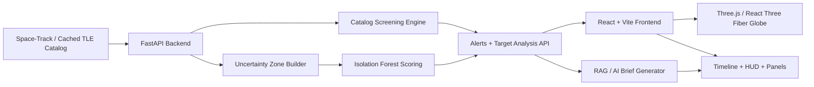

# KesslerX

Orbital intelligence for conjunction risk, debris uncertainty, and space sustainability.

## What KesslerX is

KesslerX is a real-time orbital risk analysis and simulation platform built to make conjunction risk easier to understand, inspect, and explain.

It combines:
- physics-based orbit propagation
- global risk screening
- uncertainty-zone modeling
- anomaly-aware environmental scoring
- AI-generated operator briefings

Instead of showing only raw catalog tracks, KesslerX turns orbital data into a tactical, visual decision-support experience.

## Problem

Earth orbit is getting more crowded with:
- active satellites
- spent rocket bodies
- tracked debris
- untracked environmental uncertainty

The risk is not only a single collision. The real concern is cascading fragmentation, also known as Kessler Syndrome, where one impact creates debris that increases the probability of future impacts.

Most tools are good at tracking known objects, but weaker at:
- visual clarity
- uncertainty-aware reasoning
- operator-friendly risk interpretation

## Solution

KesslerX provides a unified system for:
- tracking orbital objects on an interactive globe
- screening close approaches and high-risk conjunctions
- modeling uncertainty zones in orbital space
- generating concise AI operational briefings from structured telemetry

## Why it matters

KesslerX is designed as a decision-support and demonstration platform for:
- safer satellite operations
- clearer orbital-risk communication
- research and education around debris growth
- hackathon and prototype environments where explainability matters as much as raw math

## Core capabilities

### 1. Interactive 3D orbital view

- Earth rendered with a cinematic tactical HUD
- smooth object propagation using SGP4
- selectable satellites, debris, and rocket bodies
- threat-pair highlighting and focused inspection

### 2. Conjunction screening

- identifies meaningful close approaches
- computes minimum separation and sampled time of closest approach
- ranks threats with a conjunction risk score
- supports alert-based pair activation and analysis

### 3. Fixed 6-hour simulation window

- simulation playback is based on a continuous simulation clock
- event timestamps are precomputed for the selected object
- timeline markers remain fixed during playback
- object motion stays smooth while the UI remains deterministic

### 4. Uncertainty-zone modeling

- builds orbital-space uncertainty zones from tracked catalog conditions
- uses density, debris ratio, altitude variability, and anomaly signals
- renders soft volumetric hazard regions above Earth
- reports whether an inspected path crosses uncertainty-zone cells

### 5. ML-driven anomaly contribution

- uses Isolation Forest for unsupervised anomaly detection
- models unusual orbital behavior from:
  - mean motion
  - eccentricity
  - inclination
- contributes to environmental uncertainty, not direct collision certainty

### 6. Deep analysis and AI briefing

- per-target risk overview
- closest approach context
- orbital regime and shell metrics
- debris density and uncertainty context
- concise AI-generated mitigation-oriented explanation

## Feature summary

- Real-time catalog visualization
- Smooth orbital propagation
- Threat-pair focus mode
- Alerts panel with pair activation
- Precomputed event timeline
- Deep analysis panel
- AI operational brief
- Uncertainty-zone crossing analysis

## Architecture



## How the system works

### Data flow

1. Fetch or load the latest orbital catalog and TLE cache.
2. Parse orbital records and propagate positions with SGP4.
3. Build global alerts and target-specific conjunction analysis.
4. Construct uncertainty zones from environmental crowding and anomaly context.
5. Score anomaly contribution with Isolation Forest.
6. Serve structured analysis to the frontend.
7. Render the globe, timeline, panels, and AI explanation.

### Frontend responsibilities

- render Earth, object markers, and orbit paths
- simulate continuous motion over the 6-hour playback window
- precompute and freeze selected-object timeline events
- manage UI state for alerts, pair tracking, focus mode, and panels

### Backend responsibilities

- ingest and cache catalog data
- propagate records for screening and analysis
- compute alerts and per-target risk summaries
- build uncertainty zones and zone-crossing context
- generate AI briefings from structured context

## Risk logic

KesslerX does not use closest distance alone.

Threat ranking can stay high even when a pass is not extremely small if other factors increase operational concern.

Key contributors include:
- minimum separation distance
- urgency of time to closest approach
- altitude-shell proximity
- target consequence, especially payloads
- debris counterpart penalties
- uncertainty-zone crossings

This means a pair can still appear as a serious top threat even when its closest pass is not below a tiny threshold.

## Uncertainty modeling

Uncertainty zones are environmental, not deterministic collision objects.

The current zone logic considers:
- object density in an orbital cell
- debris ratio
- altitude variability / instability
- anomaly contribution from Isolation Forest

Rendered zone size scales with uncertainty score, and path-crossing checks are aligned with the zone footprint and altitude shell so visual context and analysis are more consistent.

## Isolation Forest in KesslerX

Isolation Forest is used as an unsupervised anomaly detector.

It is trained on catalog orbital features such as:
- mean motion
- eccentricity
- inclination

Important clarification:
- unsupervised does not mean no data
- it means no labeled data is required

In KesslerX, the model helps estimate environmental anomaly and uncertainty. It does not directly decide whether two objects will collide.

## RAG / AI operational brief

The AI layer is used for explainability, not core scoring.

It receives structured inputs such as:
- risk score and risk band
- event class
- minimum separation
- TCA
- debris share
- density band
- anomaly score
- uncertainty-zone crossing information

It returns a short operator-style brief with:
- assessment
- contributing factors
- mitigation strategy

Current implementation uses Gemini through LangChain integration on the backend.

## Tech stack

### Frontend

- React 18
- Vite
- Three.js
- React Three Fiber
- Drei
- Tailwind CSS tooling
- satellite.js

### Backend

- FastAPI
- Uvicorn
- httpx
- pydantic-settings
- python-dotenv
- sgp4

### ML and AI

- scikit-learn
- NumPy
- Isolation Forest
- LangChain
- langchain-google-genai
- Gemini-based briefing generation

### Caching / infra

- local catalog cache
- optional Redis integration

## Project structure

```text
client/
  src/
    components/
      map/        # Globe, orbit paths, uncertainty zones
      panels/     # Alerts, bottom bar, deep analysis, tactical insight
      hud/        # HUD overlays and status displays
      ui/         # Shared UI primitives

server/
  app/
    api/         # Analysis and catalog API routes
    core/        # Catalog screening, config, RAG, Redis helpers
    ml/          # Isolation Forest uncertainty model
```

## Dataset

KesslerX uses orbital catalog / TLE-style data sourced through Space-Track-compatible flows and local cache fallback.

The system currently works with:
- tracked payloads
- rocket bodies
- tracked debris

## Target users

- satellite operators
- orbital-risk researchers
- students learning space traffic and debris behavior
- sustainability and policy groups
- analysts and consultants demonstrating conjunction-risk workflows
- hackathon judges and prototype reviewers who need a clear end-to-end story

## Hackathon framing

### Problem

Orbital congestion is growing faster than most operators can intuitively reason about from raw telemetry alone.

### Impact

- higher conjunction workload
- harder communication of uncertain risk
- limited public understanding of debris cascade effects

### KesslerX contribution

KesslerX makes orbital risk:
- visible
- explainable
- interactive

## Limitations

- not a real flight operations system
- not a maneuver execution platform
- depends on public / cached orbital data quality
- uncertainty zones are probabilistic, not exact threat volumes
- AI briefing is explainability support, not authoritative decision logic
- current simulation window is limited to 6 hours

## Future scope

- longer simulation windows
- higher-fidelity conjunction refinement
- maneuver planning support
- debris cloud evolution after collision
- scenario injection and controlled collision demos
- temporal smoothing of uncertainty zones
- saved sessions and scenario replay
- Redis-backed cache / state management for heavier deployments
- operator collaboration workflows
- richer model benchmarking beyond Isolation Forest

## Getting started

### Prerequisites

- Node.js 18+
- Python 3.10+

### Backend

```bash
cd server
python -m venv .venv

# Windows
.venv\Scripts\activate

# macOS / Linux
# source .venv/bin/activate

pip install -r requirements.txt
python run.py
```

### Frontend

```bash
cd client
npm install
npm run dev
```

### Environment

Configure values in:

- `server/.env`
- `server/.env.example`

Optional services such as Redis can be enabled, but the project can run without them in prototype mode.

Current default setup uses the local cache backend. Redis support exists in the codebase, but it is optional and only activates when `CACHE_BACKEND=redis` is configured.

## Positioning

KesslerX is not just a satellite tracker.

It is an orbital intelligence prototype that combines:
- orbital mechanics
- uncertainty-aware environment modeling
- anomaly detection
- explainable AI

to help users reason about the present and near-future risk landscape in Earth orbit.

## Tagline

From orbital data to actionable intelligence.
