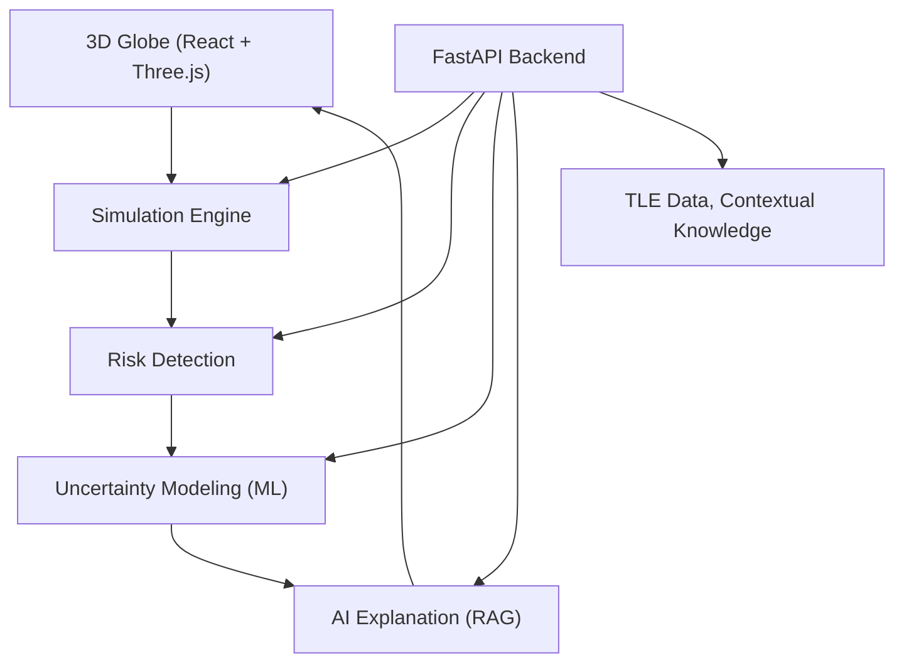

# KesslerX

KesslerX is a space surveillance and orbital risk intelligence system that models satellite motion, estimates collision risk (including from untracked debris), and provides explainable, actionable insights to help prevent cascading events like the Kessler syndrome.

---

## Problem Statement

The rapid increase in satellites and debris in Earth’s orbit is pushing us toward a critical tipping point—**Kessler Syndrome**—where collisions generate more debris, leading to a cascade of failures and loss of orbital access.

**Current limitations:**
- Most systems only track known objects.
- Untracked debris and uncertainty are ignored.
- There’s little support for explainable, operator-facing risk guidance.

---

## 🌍 Impact

- **Space sustainability:** Prevents runaway debris growth and loss of orbital access.
- **Operator safety:** Provides actionable, explainable risk insights for satellite operators and mission planners.
- **Research & education:** Demonstrates uncertainty-aware risk modeling and scenario simulation for the space community.

---

## 💡 Solution

KesslerX combines real-time 3D visualization, risk detection, uncertainty modeling, and AI-powered explanations to:
- Simulate satellite and debris motion using live TLE data.
- Detect close approaches, conjunctions, and high-risk interactions.
- Estimate probability of untracked debris using ML (Isolation Forest, KMeans).
- Allow scenario injection (add satellites, simulate collisions/cascades).
- Provide deep analysis overlays with RAG (Retrieval-Augmented Generation) explanations and mitigation advice.

---

## 🛰️ Key Features

- **3D Globe Visualization:** Real-time rendering of satellites, debris, and orbits.
- **Risk Detection Engine:** Identifies close approaches, intersections, and risk levels.
- **Uncertainty Modeling:** ML-based estimation of untracked debris zones.
- **Scenario Injection:** Add fake satellites, simulate collisions, and cascade events.
- **Simulation Controls:** Play/pause, speed, timeline, and scenario buttons.
- **Deep Analysis Overlay:** RAG-powered explanations and mitigation suggestions.

---

## 🏗️ Architecture



---

## 📁 Folder Structure

```
KesslerX/
├── client/
│   ├── src/
│   │   ├── components/
│   │   │   ├── hud/         # HUD overlays (ClassificationHeader, StatusBar, etc)
│   │   │   ├── map/         # Map/Globe overlays
│   │   │   ├── panels/      # UI panels (BottomBar, TopBar, DeepAnalysis, etc)
│   │   │   └── ui/          # UI primitives
│   │   ├── constants/       # Satellite type configs
│   │   ├── hooks/           # Custom React hooks
│   │   ├── styles/          # CSS (Tailwind, globals)
│   │   ├── utils/           # Orbital analysis helpers
│   │   └── App.jsx          # Main app entry
│   └── ...
├── server/
│   ├── app/
│   │   ├── api/             # API routes
│   │   ├── core/            # Config, core logic
│   │   ├── schemas/         # Pydantic schemas
│   │   └── main.py          # FastAPI entry
│   ├── requirements.txt
│   ├── run.py
│   └── tle_cache.json
└── README.md
```

---

## ⚙️ Tech Stack

| Layer      | Technology                        |
|------------|-----------------------------------|
| Frontend   | React (Vite), Three.js, Tailwind  |
| State Mgmt | Zustand                           |
| Backend    | FastAPI (Python), Pandas          |
| ML         | Isolation Forest, KMeans (opt.)   |
| AI         | OpenAI/Claude, Custom RAG         |
| Data       | TLE Satellite Data (Space-Track)  |
| Deploy     | Docker, Vercel                    |

---

## 🚀 Getting Started

### Backend

```bash
cd server
python -m venv .venv
.venv\Scripts\activate  # Windows
pip install -r requirements.txt
copy .env.example .env
python run.py
```

### Frontend

```bash
cd client
npm install
npm run dev
```

---

## 🔑 Environment Variables

See `.env.example` in both `client/` and `server/` for required variables (API endpoints, Space-Track credentials, etc).

---

## 🧠 Example RAG Output

> “High collision risk due to orbital intersection in a dense region. Probability of untracked debris is elevated. Suggested mitigation: increase altitude.”

---

## 📚 References

- [Kessler Syndrome - Wikipedia](https://en.wikipedia.org/wiki/Kessler_syndrome)
- [Space-Track.org](https://www.space-track.org/)
- [Three.js](https://threejs.org/)
- [FastAPI](https://fastapi.tiangolo.com/)
- The repo is structured to support future upgrades such as:
  - higher-fidelity risk engines with exact TCA workflows
  - ML-based uncertainty models
  - retrieval-backed explanation services

## One-line summary

KesslerX screens orbital risk under uncertainty and explains it clearly enough to support safer decisions before cascading collisions occur.
